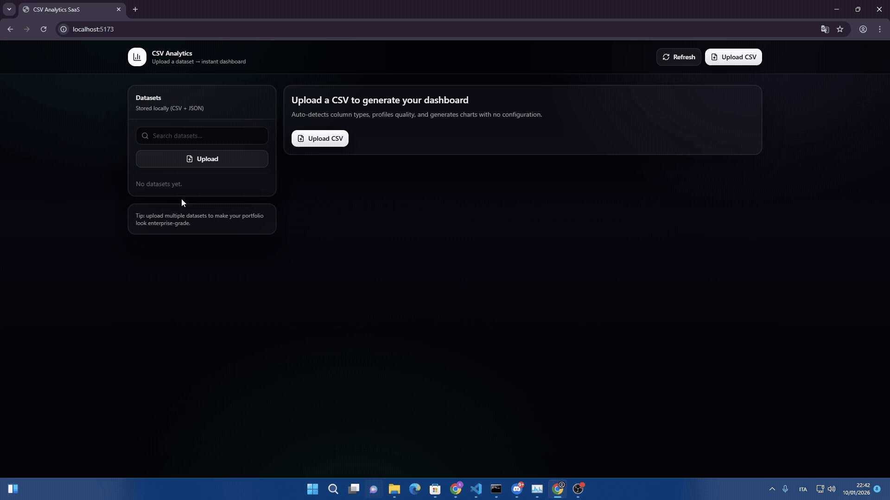
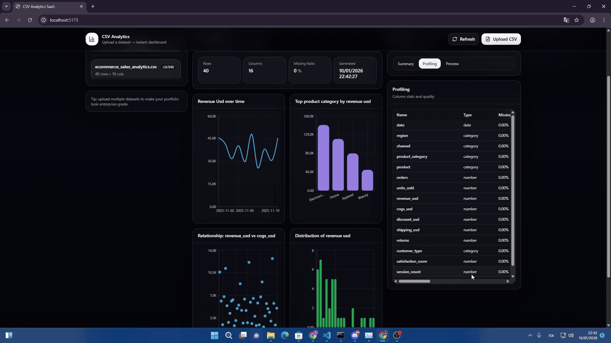

# CSV Analytics SaaS

A production-quality **B2B CSV Analytics SaaS** that automatically profiles and visualizes datasets with zero configuration.

**Upload a CSV → instantly get a professional analytics dashboard.**

---

## 🚀 What this SaaS does

CSV Analytics is a local-first analytics platform designed to turn raw CSV files into **actionable insights** in seconds.

The system automatically:
- Parses and validates CSV files
- Infers column data types
- Profiles dataset quality
- Generates KPIs and charts
- Persists everything to disk (no database)

This is not a toy project — it is built like a real SaaS MVP.

---

## 🎬 Demo

### Uploading a CSV


### Auto-generated dashboard & profiling


---

## 🧠 How it works (step by step)

1. User uploads a CSV file from the frontend
2. FastAPI receives and validates the file
3. pandas parses the CSV into a DataFrame
4. Column types are inferred automatically
5. Dataset profiling is generated
6. KPIs are computed
7. Charts are auto-selected based on detected column types
8. All outputs are saved to disk
9. Frontend renders a premium analytics dashboard

No configuration. No database. No manual setup.

---

## 🧱 Architecture Overview

Frontend (React + Vite)  
→ FastAPI backend  
→ pandas analytics engine  
→ Disk storage (CSV + JSON)  
→ Dashboard UI

---

## 📦 Tech Stack

### Frontend
- React + Vite
- TypeScript
- TailwindCSS (dark SaaS theme)
- Recharts for data visualization
- Custom ShadCN-style components

### Backend
- FastAPI
- pandas
- numpy
- JSON + CSV storage
- No database

---

## 💾 Storage Model (No Database)

Each uploaded dataset is stored locally as:

backend/data/datasets/{dataset_id}/
- original.csv  
- meta.json  
- profile.json  
- dashboard.json  

A global index tracks all datasets:

backend/data/index.json

All data survives server restarts.

---

## 📊 Automatic Profiling

For every column, the system detects:
- Column type (number, date, category, text)
- Missing value ratio
- Unique value count

### Numeric columns
- Minimum value
- Maximum value
- Mean value

### Date columns
- Start date
- End date

### Category columns
- Top values with frequency counts

---

## 📈 Automatic Visualization Logic

Charts are generated automatically with no user input:

- Date + numeric → Line chart
- Category + numeric → Bar chart (top values)
- Two numeric columns → Scatter plot
- Numeric-only column → Histogram

### KPI cards
- Row count
- Column count
- Missing ratio
- Generated timestamp

---

## 🎨 Frontend UI

- Dark mode by default
- Responsive layout
- Premium SaaS look and feel
- Sidebar dataset management
- Dashboard, Profiling, and Preview sections
- Smooth scrolling tables with sticky headers

---

## 🚫 Design Constraints

- No database
- No authentication (MVP)
- No manual chart configuration
- No placeholder UI
- No fake data

---

## 🏃 Run locally

### Backend
```
cd backend
python -m venv venv
source venv/bin/activate  # Windows: venv\Scripts\activate
pip install -r requirements.txt
uvicorn main:app --reload --port 8000
```

### Frontend
```
cd frontend
npm install
npm run dev
```

Frontend: http://localhost:5173  
Backend: http://localhost:8000  

---

## 🧑‍💻 Author

Built by **SALAH EDDINE EN-NOUAMI**  
Full-Stack Engineer — React • FastAPI • Data Analytics

---

## 🎯 Goal of this project

To demonstrate how a real-world SaaS can:
- Turn raw data into insights
- Auto-generate analytics
- Look and feel production-ready
- Be scalable without complexity
